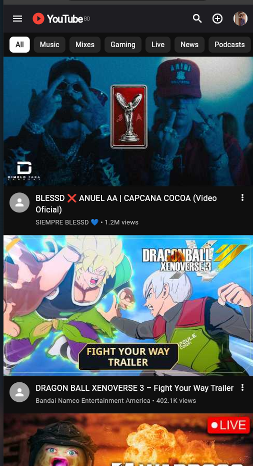

# YouTube Lite 🚀

<p align="center">
  
</p>

A beautifully crafted, lightweight YouTube client built with **Flutter**. Optimized for performance, lower-end devices, and slow internet speeds, YouTube Lite delivers a fluid and modern viewing experience.

## ✨ Features

- **Sleek Deep Dark Theme:** A stunning `0xFF0F0F0F` dark interface that perfectly mimics the premium feel of native apps.
- **Google Authentication:** Secure and seamless login using Firebase Auth. Personalize your experience instantly.
- **Dynamic Profile Integration:** Adaptive navigation drawer and AppBar that reflect your real Google profile data and avatar.
- **Interactive Video Player:** Built with `youtube_player_iframe` for a robust, cross-platform video playback experience (Mobile & Web).
- **Smooth Navigation:** Category chips (All, Music, Gaming, Live, etc.) and a beautifully animated bottom navigation bar.
- **Responsive Design:** Carefully crafted layouts that look brilliant on both mobile devices and desktop browsers.

## 🛠️ Technology Stack

- **Framework:** [Flutter](https://flutter.dev/) (Cross-platform UI)
- **Backend/Auth:** [Firebase](https://firebase.google.com/) & Google Sign-In
- **State Management:** `provider` (Clean, scalable architecture)
- **Video Player:** `youtube_player_iframe`
- **Environment:** `flutter_dotenv` (Secure API key management)

## 🚀 Getting Started

### Prerequisites

Ensure you have the following installed:
- [Flutter SDK](https://docs.flutter.dev/get-started/install) (v3.13.2 or higher)
- [Firebase CLI](https://firebase.google.com/docs/cli) (for backend configuration)

### Installation

1. **Clone the repository:**
   ```bash
   git clone https://github.com/yourusername/youtube_lite.git
   cd youtube_lite
   ```

2. **Install dependencies:**
   ```bash
   flutter pub get
   ```

3. **Configure Environment Variables:**
   Create a `.env` file in the root directory and add your YouTube Data API key:
   ```env
   YOUTUBE_API_KEY=your_api_key_here
   ```

4. **Run the App:**
   ```bash
   flutter run
   ```
   *(To run on Chrome specifically: `flutter run -d chrome`)*

## 📱 Screenshots & UI

The UI is built with incredible attention to detail, matching the visual aesthetics of the official application while maintaining a fraction of the memory footprint. Everything from the corner radii, typography, and micro-animations have been meticulously styled.

## 🤝 Contributing

Contributions, issues, and feature requests are welcome! Feel free to check the [issues page](https://github.com/yourusername/youtube_lite/issues).

## 📝 License

This project is licensed under the MIT License - see the [LICENSE](LICENSE) file for details.
